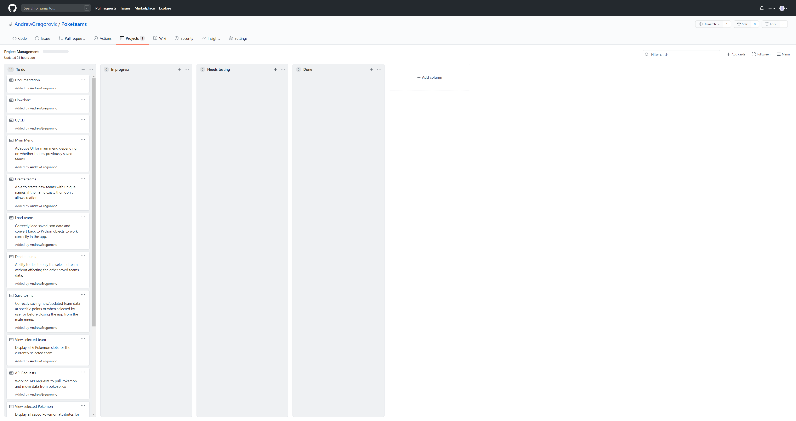

# Pokéteams

A Pokémon team builder terminal application that pulls pokémon related data from the awesome PokéAPI hosted at [pokeapi.co](https://pokeapi.co). Pokéteams will help you build the ultimate pokémon teams when you're unable to play the games but are at a computer and have access to a terminal.

- Create as many teams as you'd like so that you're never unprepared for a fight.
- Update teams by changing their Pokémon or the moves you want those Pokémon to know.
- Save teams for later viewing or to continue building if you're interrupted in the middle of creating a new team.
- Delete teams that you no longer need/want.

All the saved team information is stored in a single json file called `team_data.json` and is all you need to transfer between computers to take your saved teams with you (both computers need Pokéteams installed to load the data and display it for easy viewing).

Even if you don't have an internet connection, you'll still be able to load up and view previously saved teams!

## Table of Contents
- [Requirements](#requirements)
- [Installation](#installation)
- [Instructions](#instructions)
- [Development Overview](#development-overview)
- [Handling I/O](#handling-io)
- [Solution Structure](#solution-structure)
- [Control Flow Diagram](#control-flow-diagram)
- [Application Dependencies](#application-dependencies)
- [Implementation Plan](#implementation-plan)

## Requirements

Pokéteams requires Python 3.8 as well as all the modules listed in `requirements.txt`. To easily install all the required modules you can use the command `pip install -r requirements.txt` or `pip3 install -r requirements.txt` depending on how Python is set up on your system.

An internet connection is also required for the Pokéteams to have full functionality as it needs to connect to pokeapi.co to get the data used to build teams.

It is also best to increase your terminal window size to be as close to 135w x 53h (columns x lines) as possible, at lower sizes some parts of the app will not look as intended. This is a recommendation, not a requirement!

> Note: This was created in a linux environment, so it may not run 100% correctly on another operating system.

## Installation

Getting Pokéteams set up on your local machine only takes a few simple steps
1. Download the repository by either:
    - Using the command `git clone https://github.com/AndrewGregorovic/Poketeams.git <target/directory>`
    - Downloading the zip file and unzip it to the target directory
2. Install the modules in `requirements.txt` using the commands mentioned above in [Requirements](#requirements) 
3. In your terminal run the command `<path/to>/Poketeams/src/main.py`

If you have issues running `main.py` as an executable use the command `python <path/to>/Poketeams/src/main.py` or `python3 <path/to>/Poketeams/src/main.py` again depending on your Python set up.

## Instructions

Using the Pokéteams app is very straightforward and uses an easy to navigate UI to improve user friendliness. Simply navigate the menus as instructed on screen, using enter to select the desired option or to confirm text input.

> If you are having any trouble with the app, running it with the `--help` option will display the contents of the `help.md` file which contains the Requirements, Installation and Instructions sections of this readme document.

# Development Overview

Pokéteams provides an algorithmic solution to allow the building of Pokémon teams within a terminal application. It utilises two-way communication over the internet to send http requests to an api and receive response data to those api calls, providing information vital to application functions which are necessary for the application to run correctly. Additionally the algorithm manages team data that is created within the application and facilitates saving/loading the team data to/from a local file in json format.

## Handling I/O

Preventing errors and ensuring that the application runs without issue is of paramount importance during the development process, user input and application output are two areas where the application can easily encounter fatal issues. With this in mind certain measures have been taken to reduce the likelihood of errors when handling input and output.

Regarding input, `PyInquirer` was chosen to create the user input fields as it significantly limits the input that can be provided to the application by the user and in the case of text input, it allows for input to be validated before it is accepted by the application to prevent invalid inputs. For text input fields there is also still some input sanitisation required to ensure that the input matches what the application expects to receive. Input from api calls is much less of an issue as the response data is in json format and the api documentation displays the structure and type of the data element, from this there very little chance of any input related errors occuring from api responses.

Output on the other hand can produce lot of errors due to variables being assigned to hold different data types and having arrays of various lengths, to give a few common examples. To avoid these issues the application source code dealing with output needs to be very thorough to ensure that any edge cases are being handled appropriately and type hinting is used to ensure that variables and functions are using the correct data types to avoid type errors.

## Solution Structure

The Pokéteams application is built with a focus on object oriented programming. There are multiple classes created and used by the application as it runs,
- the `Data` class functions as a sort of controller for the team data, loading and saving it from the json file and managing it as it gets created or altered by the user. This class also contains the main menu of the application and functions related to it.
- the `Team` class holds the team level data, i.e. the team name and the pokémon list for the team, along with the functions and menu that are relevant to team information.
- the `Pokemon` class holds all essential information about a pokémon object that is pulled from PokéAPI. It contains all functions related to a pokémon's information and menu, and also includes functions related to searching and retrieving pokémon data from the api.
- the `Move` class holds all essential information about a move object that is pulled from PokéAPI. It again contains all functions related to a move's information, menu and retrieving move data from the api.
- the `APIHandler` class simply handles the api urls used to fetch the data of various groups from the api.

The main python file does not contain a class of its own, the purpose of the code in this file is to handle the core logic of the application, instantiate objects when necessary and call the correct methods when appropriate for the application to run as intended.

## Control Flow Diagram

The control flow diagram displayed below is a rough representation of how the application functions.

## Application Dependencies

The following modules have been directly imported and used by the Pokéteams application.

Python standard libraries
- `json`: Used to deserialize and serialize data between python data types and json. It is used alongside the requests module to retrieve data from PokéAPI and to save/load team data for persistence between application sessions.
- `os`: Used to perform terminal commands within python code for the application to function as intended.
- `shutil`: Used to delete the `src/json/` directory  for testing purposes, and move `team_data.json` in and out of the `/json` directory to avoid being deleted by the tests.
- `sys`: Used to check for the presence of the `--help` option when starting the application and to insert the `src/` directory into the system path variable to aid in importing source code into the unit testing files.
- `time`: Used for a sleep timer to provide enough time for users to read the error messages when a connection error occurs, before the application exits.
- `typing`: Used to create Union objects for type hinting variables that can contain multiple data types.
- `unittest`: Used for automated and manual testing to check that certain functions within the source code are working correctly.

3rd party libraries
- `art`: Used to create the ascii art featured on the main menu.
- `mypy`: Used to check type hinting rules are being followed in the source code.
- `PyInquirer`: Used to create all the sections that require user input improving usability and user friendliness.
- `requests`: Used to make the http requests to fetch data from PokéAPI.
- `requests_cache`: Used to create a cache file to store data retrieved from api calls. This improves performance when making repeat requests and reduces the number of api calls the application needs to make. This is also used to ensure that the application follows PokéAPI's fair use policy.

While it's not a dependency, this application also uses `flake8` to check that the source code is following the PEP8 style guide. As PEP8 is only a set of guidelines, the source code doesn't follow them religiously. In particular E501 which recommends that lines are no longer than 79 characters would in my opinion cause certain sections of code to be less readable and cause issues with trying to follow other points in the style guide so it is ignored.

## Implementation Plan

For development of this application I have chosen to use the Projects section of the Pokéteams github repository to track development progress. Previously I have used Trello however as this app is being developed on my local machine with commits being pushed directly to github, it made sense to use githubs provided Projects section rather than Trello in this case. Some screenshots of the project board during development are linked below with many more included in this repository inside the `docs/` directory.

> Note: Images may need to be viewed at full size to more easily and clearly read the text.

